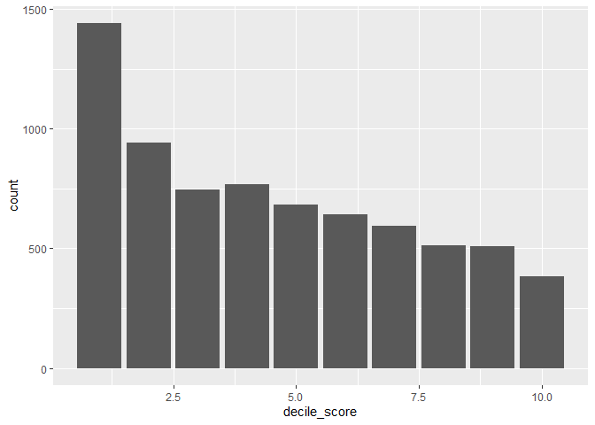
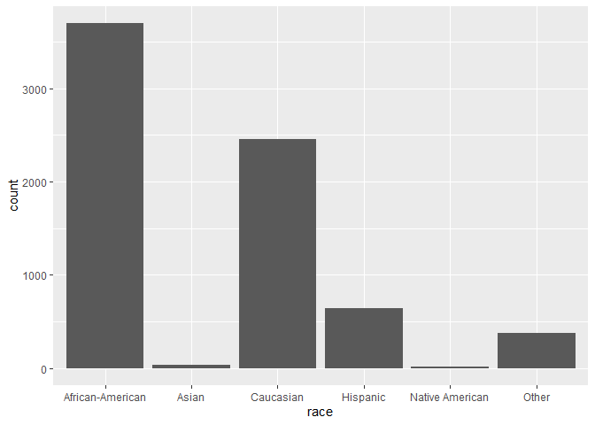
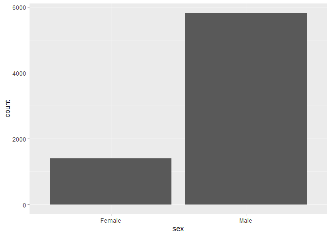
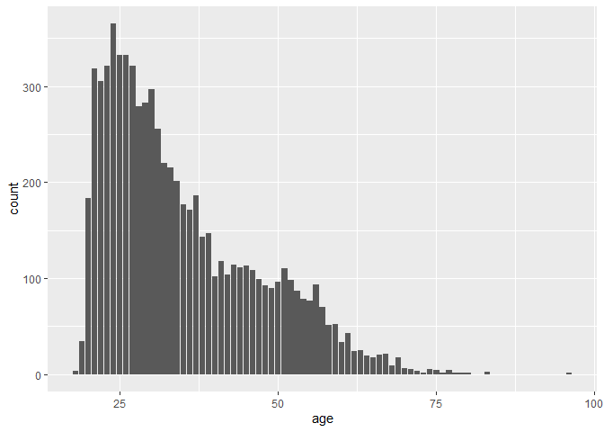
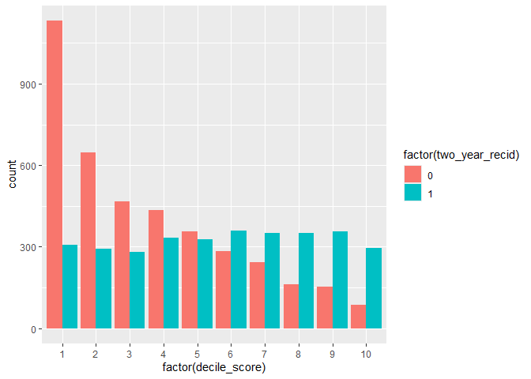
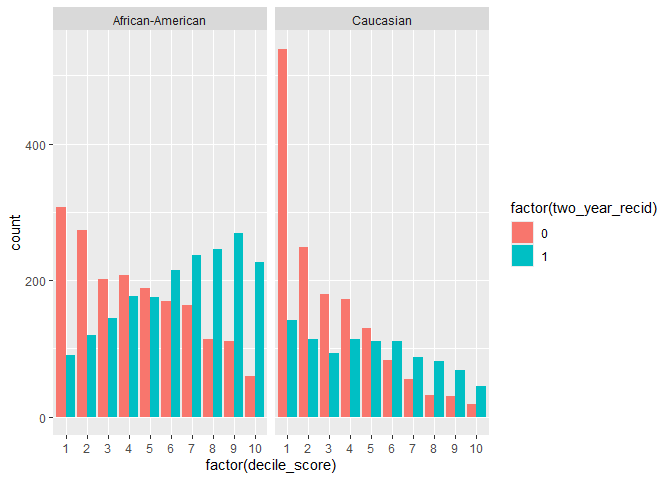
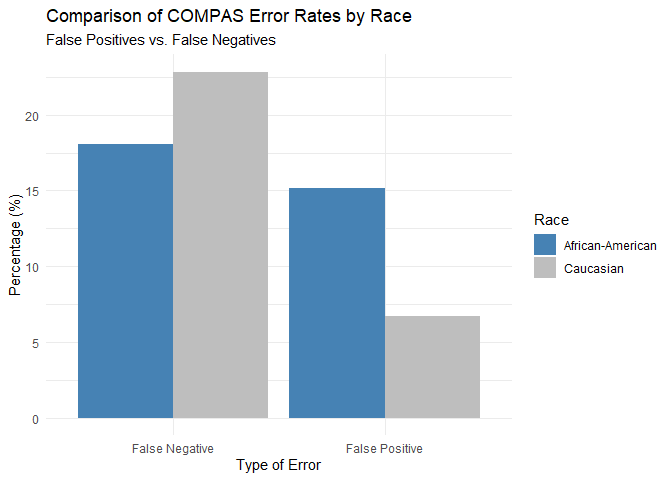
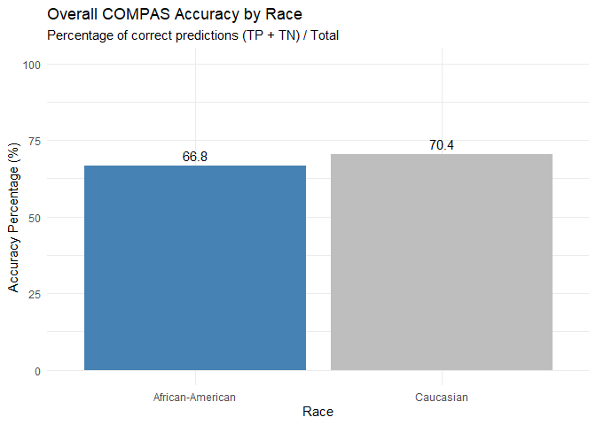
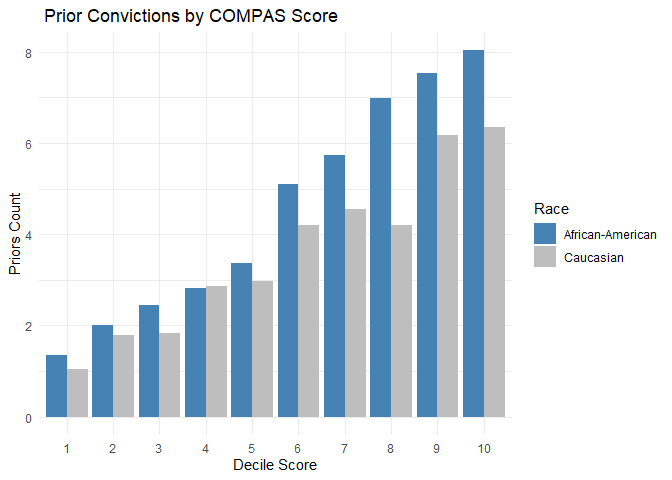
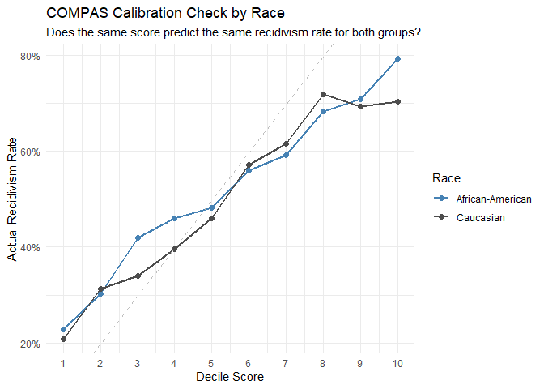

Lab 09: Algorithmic Bias
================
Kryschelle
5/04/2026

## Load Packages and Data

First, let’s load the necessary packages:

``` r
library(tidyverse)
library(fairness)
```

    ## Warning: package 'fairness' was built under R version 4.5.3

``` r
library(janitor)
```

    ## Warning: package 'janitor' was built under R version 4.5.3

``` r
library(readr)
```

### The data

For this lab, we’ll use the COMPAS dataset compiled by ProPublica. The
data has been preprocessed and cleaned for you. You’ll have to load it
yourself. The dataset is available in the `data` folder, but I’ve
changed the file name from `compas-scores-two-years.csv` to
`compas-scores-2-years.csv`. I’ve done this help you practice debugging
code when you encounter an error.

``` r
# Load the COMPAS data
compas <- read_csv("data/compas-scores-2-years.csv") %>%
  clean_names() %>%
  rename(
    decile_score = decile_score_12,
    priors_count = priors_count_15
  )
```

    ## New names:
    ## Rows: 7214 Columns: 53
    ## ── Column specification
    ## ──────────────────────────────────────────────────────── Delimiter: "," chr
    ## (19): name, first, last, sex, age_cat, race, c_case_number, c_charge_de... dbl
    ## (19): id, age, juv_fel_count, decile_score...12, juv_misd_count, juv_ot... lgl
    ## (1): violent_recid dttm (2): c_jail_in, c_jail_out date (12):
    ## compas_screening_date, dob, c_offense_date, c_arrest_date, r_offe...
    ## ℹ Use `spec()` to retrieve the full column specification for this data. ℹ
    ## Specify the column types or set `show_col_types = FALSE` to quiet this message.
    ## • `decile_score` -> `decile_score...12`
    ## • `priors_count` -> `priors_count...15`
    ## • `decile_score` -> `decile_score...40`
    ## • `priors_count` -> `priors_count...49`

``` r
# Take a look at the data
glimpse(compas)
```

    ## Rows: 7,214
    ## Columns: 53
    ## $ id                      <dbl> 1, 3, 4, 5, 6, 7, 8, 9, 10, 13, 14, 15, 16, 18…
    ## $ name                    <chr> "miguel hernandez", "kevon dixon", "ed philo",…
    ## $ first                   <chr> "miguel", "kevon", "ed", "marcu", "bouthy", "m…
    ## $ last                    <chr> "hernandez", "dixon", "philo", "brown", "pierr…
    ## $ compas_screening_date   <date> 2013-08-14, 2013-01-27, 2013-04-14, 2013-01-1…
    ## $ sex                     <chr> "Male", "Male", "Male", "Male", "Male", "Male"…
    ## $ dob                     <date> 1947-04-18, 1982-01-22, 1991-05-14, 1993-01-2…
    ## $ age                     <dbl> 69, 34, 24, 23, 43, 44, 41, 43, 39, 21, 27, 23…
    ## $ age_cat                 <chr> "Greater than 45", "25 - 45", "Less than 25", …
    ## $ race                    <chr> "Other", "African-American", "African-American…
    ## $ juv_fel_count           <dbl> 0, 0, 0, 0, 0, 0, 0, 0, 0, 0, 0, 0, 0, 0, 0, 0…
    ## $ decile_score            <dbl> 1, 3, 4, 8, 1, 1, 6, 4, 1, 3, 4, 6, 1, 4, 1, 3…
    ## $ juv_misd_count          <dbl> 0, 0, 0, 1, 0, 0, 0, 0, 0, 0, 0, 0, 0, 0, 0, 0…
    ## $ juv_other_count         <dbl> 0, 0, 1, 0, 0, 0, 0, 0, 0, 0, 0, 0, 0, 0, 0, 0…
    ## $ priors_count            <dbl> 0, 0, 4, 1, 2, 0, 14, 3, 0, 1, 0, 3, 0, 0, 1, …
    ## $ days_b_screening_arrest <dbl> -1, -1, -1, NA, NA, 0, -1, -1, -1, 428, -1, 0,…
    ## $ c_jail_in               <dttm> 2013-08-13 06:03:42, 2013-01-26 03:45:27, 201…
    ## $ c_jail_out              <dttm> 2013-08-14 05:41:20, 2013-02-05 05:36:53, 201…
    ## $ c_case_number           <chr> "13011352CF10A", "13001275CF10A", "13005330CF1…
    ## $ c_offense_date          <date> 2013-08-13, 2013-01-26, 2013-04-13, 2013-01-1…
    ## $ c_arrest_date           <date> NA, NA, NA, NA, 2013-01-09, NA, NA, 2013-08-2…
    ## $ c_days_from_compas      <dbl> 1, 1, 1, 1, 76, 0, 1, 1, 1, 308, 1, 0, 0, 1, 4…
    ## $ c_charge_degree         <chr> "F", "F", "F", "F", "F", "M", "F", "F", "M", "…
    ## $ c_charge_desc           <chr> "Aggravated Assault w/Firearm", "Felony Batter…
    ## $ is_recid                <dbl> 0, 1, 1, 0, 0, 0, 1, 0, 0, 1, 0, 1, 0, 0, 1, 1…
    ## $ r_case_number           <chr> NA, "13009779CF10A", "13011511MM10A", NA, NA, …
    ## $ r_charge_degree         <chr> NA, "(F3)", "(M1)", NA, NA, NA, "(F2)", NA, NA…
    ## $ r_days_from_arrest      <dbl> NA, NA, 0, NA, NA, NA, 0, NA, NA, 0, NA, NA, N…
    ## $ r_offense_date          <date> NA, 2013-07-05, 2013-06-16, NA, NA, NA, 2014-…
    ## $ r_charge_desc           <chr> NA, "Felony Battery (Dom Strang)", "Driving Un…
    ## $ r_jail_in               <date> NA, NA, 2013-06-16, NA, NA, NA, 2014-03-31, N…
    ## $ r_jail_out              <date> NA, NA, 2013-06-16, NA, NA, NA, 2014-04-18, N…
    ## $ violent_recid           <lgl> NA, NA, NA, NA, NA, NA, NA, NA, NA, NA, NA, NA…
    ## $ is_violent_recid        <dbl> 0, 1, 0, 0, 0, 0, 0, 0, 0, 1, 0, 0, 0, 0, 0, 0…
    ## $ vr_case_number          <chr> NA, "13009779CF10A", NA, NA, NA, NA, NA, NA, N…
    ## $ vr_charge_degree        <chr> NA, "(F3)", NA, NA, NA, NA, NA, NA, NA, "(F2)"…
    ## $ vr_offense_date         <date> NA, 2013-07-05, NA, NA, NA, NA, NA, NA, NA, 2…
    ## $ vr_charge_desc          <chr> NA, "Felony Battery (Dom Strang)", NA, NA, NA,…
    ## $ type_of_assessment      <chr> "Risk of Recidivism", "Risk of Recidivism", "R…
    ## $ decile_score_40         <dbl> 1, 3, 4, 8, 1, 1, 6, 4, 1, 3, 4, 6, 1, 4, 1, 3…
    ## $ score_text              <chr> "Low", "Low", "Low", "High", "Low", "Low", "Me…
    ## $ screening_date          <date> 2013-08-14, 2013-01-27, 2013-04-14, 2013-01-1…
    ## $ v_type_of_assessment    <chr> "Risk of Violence", "Risk of Violence", "Risk …
    ## $ v_decile_score          <dbl> 1, 1, 3, 6, 1, 1, 2, 3, 1, 5, 4, 4, 1, 2, 1, 2…
    ## $ v_score_text            <chr> "Low", "Low", "Low", "Medium", "Low", "Low", "…
    ## $ v_screening_date        <date> 2013-08-14, 2013-01-27, 2013-04-14, 2013-01-1…
    ## $ in_custody              <date> 2014-07-07, 2013-01-26, 2013-06-16, NA, NA, 2…
    ## $ out_custody             <date> 2014-07-14, 2013-02-05, 2013-06-16, NA, NA, 2…
    ## $ priors_count_49         <dbl> 0, 0, 4, 1, 2, 0, 14, 3, 0, 1, 0, 3, 0, 0, 1, …
    ## $ start                   <dbl> 0, 9, 0, 0, 0, 1, 5, 0, 2, 0, 0, 4, 1, 0, 0, 0…
    ## $ end                     <dbl> 327, 159, 63, 1174, 1102, 853, 40, 265, 747, 4…
    ## $ event                   <dbl> 0, 1, 0, 0, 0, 0, 1, 0, 0, 1, 0, 1, 0, 0, 1, 1…
    ## $ two_year_recid          <dbl> 0, 1, 1, 0, 0, 0, 1, 0, 0, 1, 0, 1, 0, 0, 1, 1…

## Exercise Part 1: Exploring the Data

``` r
nrow(compas)
```

    ## [1] 7214

``` r
ncol(compas)
```

    ## [1] 53

The dimensions of the dataset are 7214 by 53. Each row represents a
defendant. The variables include demographics and information regarding
their charges, offenses, as well as their COMPAS scores and their
recidivism rate.

``` r
length(unique(compas$name))
```

    ## [1] 7158

There are 7158 unique defendants in the dataset. This is not the same as
rows because some people may show up multiple times in the dataset due
to repeat offenses (or recidivism).

``` r
ggplot(compas, aes(x = decile_score)) +
  geom_bar()
```

<!-- -->

Based on the graph, the distribution is positively skewed, indicating
that most people are viewed as low risk.

``` r
ggplot(compas, aes(x = race)) +
  geom_bar()
```

<!-- -->

``` r
ggplot(compas, aes(x = sex)) +
  geom_bar()
```

<!-- -->

``` r
ggplot(compas, aes(x = age)) +
  geom_bar()
```

<!-- -->

## Part 2: Risk Scores and Recividism

``` r
ggplot(compas, aes(x = factor( decile_score), fill = factor( two_year_recid))) +
  geom_bar(position = "dodge")
```

<!-- -->

Higher risk scores don’t actually relate to higher levels of recidivism.
People who did recidivate two years later did have higher compas scores
than people who didn’t but people who recidivated don’t seem just as
likely to have a high risk score as a low risk score.

``` r
compas <- compas %>% 
  mutate(classification = case_when(
    decile_score >= 7 & two_year_recid == 1 ~ "TP", 
             decile_score <= 4 & two_year_recid == 0 ~ "TN", 
             decile_score >= 7 & two_year_recid == 0 ~ "FP", 
             decile_score <= 4 & two_year_recid == 1 ~ "FN")
  )

results <- table(compas$classification)
print(results)
```

    ## 
    ##   FN   FP   TN   TP 
    ## 1216  644 2681 1351

``` r
correct <- results["TP"] + results["TN"]
cases <- results["TP"] + results["TN"] + results["FP"] + results["FN"]

accuracy <- (correct/cases) * 100
print(accuracy)
```

    ##       TP 
    ## 68.43177

To see how accurate the test is, I divided the correct cases by the
total cases and multipled that by 100 to determine the “accuracy”
percentage. About 68% of the cases are correct.

## Part 3: Investigating Disparities

``` r
compas_bw <- compas %>%
  filter(race %in% c("African-American", "Caucasian"))

ggplot(compas_bw, aes(x = factor(decile_score), fill = factor(two_year_recid))) +
  geom_bar(position = "dodge") + 
  facet_wrap(~ race) 
```

<!-- -->

``` r
compas_bw_b <- compas %>%
  filter(race %in% c("African-American"))

compas_bw_w <- compas %>%
  filter(race %in% c("Caucasian"))

compas_bw_w <- compas_bw_w %>% 
  mutate(classification = case_when(
    decile_score >= 7 & two_year_recid == 1 ~ "TP", 
    decile_score <= 4 & two_year_recid == 0 ~ "TN", 
    decile_score >= 7 & two_year_recid == 0 ~ "FP", 
    decile_score <= 4 & two_year_recid == 1 ~ "FN"
  )) 

res_b <- table(compas_bw_b$classification)
res_w <- table(compas_bw_w$classification)

acc_black <- (res_b["TP"] + res_b["TN"]) / sum(res_b) * 100
acc_white <- (res_w["TP"] + res_w["TN"]) / sum(res_w) * 100


print(acc_black)
```

    ##       TP 
    ## 66.77978

``` r
print(acc_white)
```

    ##       TP 
    ## 70.43091

``` r
fp_acc_black <- (res_b["FP"]) / sum(res_b) * 100
fp_acc_white <- (res_w["FP"]) / sum(res_w) * 100

fn_acc_black <- (res_b["FN"]) / sum(res_b) * 100
fn_acc_white <- (res_w["FN"]) / sum(res_w) * 100

print(fp_acc_black)
```

    ##       FP 
    ## 15.16797

``` r
print(fp_acc_white)
```

    ##       FP 
    ## 6.736008

``` r
print(fn_acc_black)
```

    ##       FN 
    ## 18.05226

``` r
print(fn_acc_white)
```

    ##       FN 
    ## 22.83309

``` r
plot_data <- data.frame(
  Race = c("African-American", "Caucasian", "African-American", "Caucasian"),
  Error_Type = c("False Positive", "False Positive", "False Negative", "False Negative"),
  Percentage = c(fp_acc_black, fp_acc_white, fn_acc_black, fn_acc_white)
)

accuracy_data <- data.frame(
  Race = c("African-American", "Caucasian"),
  Accuracy = c(acc_black, acc_white)
)

print(accuracy_data)
```

    ##               Race Accuracy
    ## 1 African-American 66.77978
    ## 2        Caucasian 70.43091

``` r
print(plot_data)
```

    ##               Race     Error_Type Percentage
    ## 1 African-American False Positive  15.167967
    ## 2        Caucasian False Positive   6.736008
    ## 3 African-American False Negative  18.052257
    ## 4        Caucasian False Negative  22.833086

``` r
ggplot(plot_data, aes(x = Error_Type, y = Percentage, fill = Race)) +
  geom_col(position = "dodge") + 
  labs(
    title = "Comparison of COMPAS Error Rates by Race",
    subtitle = "False Positives vs. False Negatives",
    y = "Percentage (%)",
    x = "Type of Error"
  ) +
  theme_minimal() +
  scale_fill_manual(values = c("African-American" = "steelblue", "Caucasian" = "gray"))
```

<!-- -->

``` r
ggplot(accuracy_data, aes(x = Race, y = Accuracy, fill = Race)) +
  geom_col() + 
  geom_text(aes(label = round(Accuracy, 1)), visualize = TRUE, vjust = -0.5) +
  labs(
    title = "Overall COMPAS Accuracy by Race",
    subtitle = "Percentage of correct predictions (TP + TN) / Total",
    x = "Race",
    y = "Accuracy Percentage (%)"
  ) +
  scale_fill_manual(values = c("African-American" = "steelblue", "Caucasian" = "gray")) +
  ylim(0, 100) +
  theme_minimal() +
  theme(legend.position = "none") 
```

    ## Warning in geom_text(aes(label = round(Accuracy, 1)), visualize = TRUE, :
    ## Ignoring unknown parameters: `visualize`

<!-- -->

The overall accuracy is lower for African Americans and the rate of
false positives (high risk without recidivation) was higher for
African-Americans. Furthermore, way more white individuals were
classified as low risk but did recidivate (false negative). Using column
plots provides the simplicity of bar and histograms while also modelling
relationships. I find bar plots to be some of the simplest to understand
when done right and, as such, viewers can easily see the percentages of
the accuracy and compare the numbers of false positives and false
negatives.

note: I really enjoy this lab but it is quite long and has taken me a
while. It might be useful to condense or remove some sections.

## Part 4: Understanding the sources of bias

I

``` r
ggplot(compas_bw, aes(x = factor(decile_score), y = priors_count, fill = race)) +
  stat_summary(fun = "mean", geom = "bar", position = "dodge") +
  labs(
    title = " Prior Convictions by COMPAS Score",
    x = "Decile Score",
    y = "Priors Count",
    fill = "Race"
  ) +
  theme_minimal() +
  scale_fill_manual(values = c("African-American" = "steelblue", "Caucasian" = "gray"))
```

<!-- -->

``` r
calibration_data <- compas_bw %>%
  group_by(race, decile_score) %>%
  summarize(
    recidivism_rate = mean(two_year_recid),
    total_people = n()
  ) %>%
  ungroup()
```

    ## `summarise()` has grouped output by 'race'. You can override using the
    ## `.groups` argument.

``` r
ggplot(calibration_data, aes(x = decile_score, y = recidivism_rate, color = race)) +
  geom_line(size = 1) +
  geom_point(size = 2) +
  geom_abline(intercept = 0, slope = 0.1, linetype = "dashed", color = "gray") +
  scale_x_continuous(breaks = 1:10) +
  scale_y_continuous(labels = scales::percent) +
  labs(
    title = "COMPAS Calibration Check by Race",
    subtitle = "Does the same score predict the same recidivism rate for both groups?",
    x = "Decile Score",
    y = "Actual Recidivism Rate",
    color = "Race"
  ) +
  scale_color_manual(values = c("African-American" = "steelblue", "Caucasian" = "gray30")) +
  theme_minimal()
```

    ## Warning: Using `size` aesthetic for lines was deprecated in ggplot2 3.4.0.
    ## ℹ Please use `linewidth` instead.
    ## This warning is displayed once per session.
    ## Call `lifecycle::last_lifecycle_warnings()` to see where this warning was
    ## generated.

<!-- -->

Based on the analysis, there is evidence that the algorithm is fair.
Obtaining the same score as an African-American predicts similar or the
same recidivism rate as for Caucasian’s except for around a Decile Score
of 3 and 4. However, once the score is high enough, the algorithm can
predict the recidivism rate.

## Part 5: Fairer Algorithms

To make a fairer assessment algorithm, I would mainly address the
mischaracterization of Black individuals as high risk. It would be
interesting to know what exactly goes into characterizing individuals as
high risk versus low risk – is it the severity of the charge? Is it the
felonies? I’m not sure what exactly goes into the algorithm but I would
start there.

When thinking about “fairness” I think people often imagine “equality”
instead of “equity.” The danger that follows this is an over examination
of black behaviors and faster sentencing and labelling of black
individuals compared to their white counterparts. We see this happen
socially with the adultification of black children. Where a black child
gets penalized by the system, their white counterpart may get a warning.
As such, black children and people seem to be ‘repeat offenders’
compared to their white counterparts. Additionally, we have to consider
that black people are disporportionately represented in the system. An
argument a lot of people present is that more white individuals go to
jail. While this is true, people forget porportions. Individuals should
consider porportions of the population when redesigning algorithms that
can shape people’s lives.
